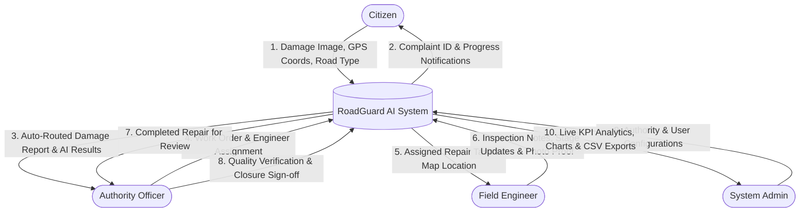
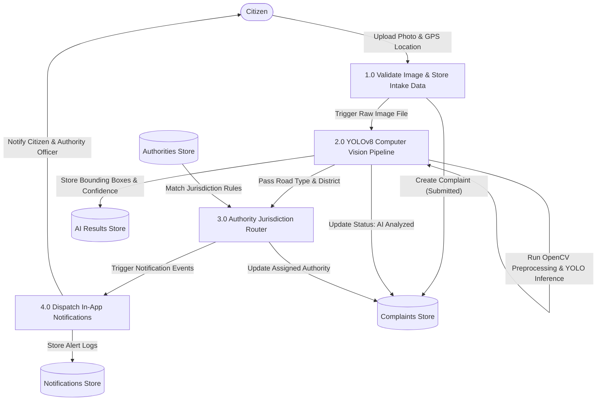
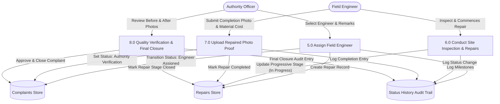

# RoadGuard AI – Data Flow Diagrams (DFD)

## 1. Context Level DFD (Level 0)

---

## 2. Level 1 DFD: Complaint Intake & AI Processing

---

## 3. Level 2 DFD: Maintenance Execution & Authority Closure

