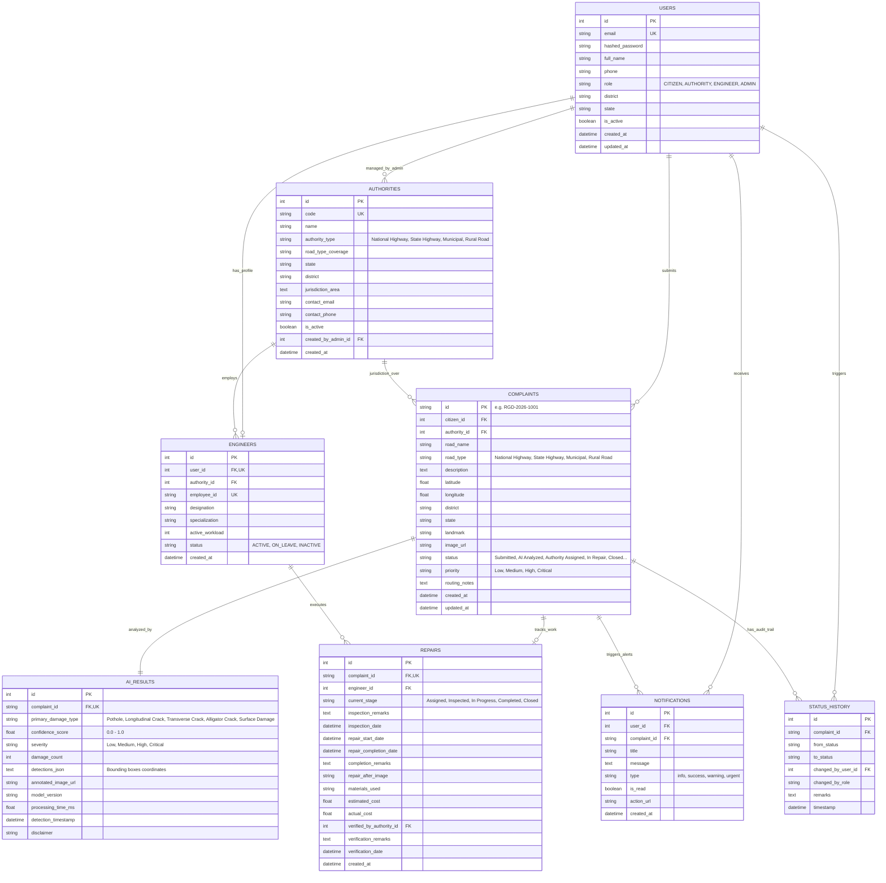

# RoadGuard AI – Entity Relationship (ER) Diagram & Schema Specification

## 1. Mermaid Entity-Relationship Diagram

---

## 2. Table Specifications & Normalization

- **Normalization**: Database adheres to **3rd Normal Form (3NF)** with zero transitive dependencies.
- **Constraints & Indexes**:
  - `users.email`: Unique index for fast auth lookup.
  - `complaints.latitude`, `complaints.longitude`: Indexed for rapid spatial bounds queries.
  - `complaints.status`, `complaints.road_type`, `complaints.district`: Indexed for dashboard filtering.
  - Foreign key cascading: Deleting a complaint safely cascades associated AI results and notifications.
